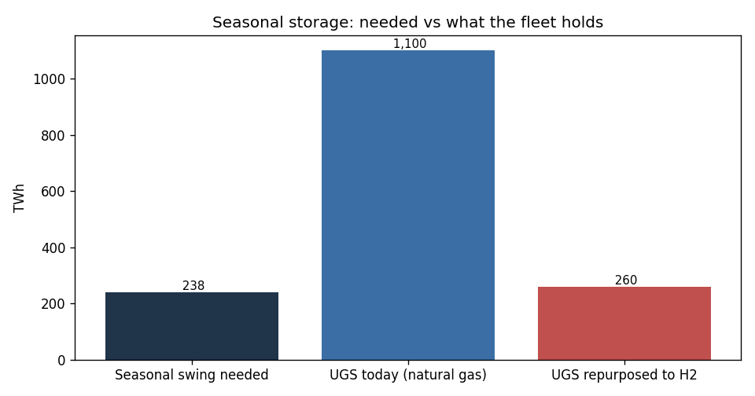
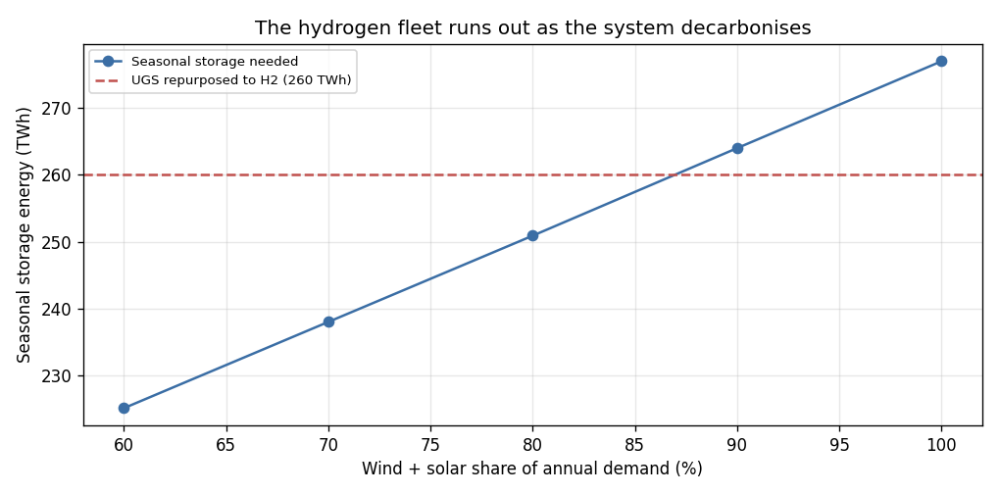

# europe-energy-storage-adequacy

**Europe measures winter gas security with one number — how full storage is. That number is
wrong in three ways, and this repo quantifies all three from public data.**

[](https://github.com/Pr0spektor/europe-energy-storage-adequacy/actions/workflows/ci.yml)

Author: **[Pr0spektor](https://github.com/Pr0spektor)**

---

## The edge

A storage-fill percentage silently assumes that volume is the constraint, that storage is the
only source of flexibility, and that a national total describes a national system. All three
assumptions fail, and each failure is measurable:

**1 · Volume, rate and duration are three different scarcities — and they rank countries differently.**
Germany holds the largest fleet in Europe, **246 TWh**, and empties it in **35 days** at maximum
rate. Spain holds a seventh of that and lasts **171 days**. Last winter **Belgium and Portugal
hit 96% of their own withdrawal *rate*** on the peak day while looking comfortable on fill.
A single "% full" target speaks to none of these.

**2 · Storage is not the only flexibility, and the alternative carries a different risk.**
On its peak day **84% of Spain's and 81% of Belgium's flexibility arrived by LNG ship**, against
**14% for Germany**. Regasification needs no geology and builds fast — but it depends on a cargo
being at the jetty on exactly the days every other importer is bidding for it. Caverns are
pre-positioned; ships are not. A fill-based metric scores Iberia safe and misses the exposure
entirely.

**3 · National aggregates hide the concentration that actually breaks.**
**Rehden alone is 35.7 TWh — 14% of German working volume — and sat at 6% full.** On the peak
winter gas day Norway supplied **1,015 GWh/d** into Germany through two coastal point clusters,
**both running above their published firm capacity (162% and 139%)** — i.e. on interruptible
terms. Neither fact is visible in any national percentage.

**Put together, they produce the result the fill metric cannot express:**

> A colder winter does not slowly drain Europe. **It converts volume problems into rate problems.**
> At a repeat of last winter's worst day, 3 countries are already rate-bound on day one. At 1.4x
> that day, 10 are — including France. Different failure, different timescale, different fix.


Each layer of the argument has a chart behind it. Storage fill against the 90% refill
target, how close each country came to its own maximum withdrawal rate, where the peak
day actually came from, and where Germany's border binds:


### And the hydrogen buffer does not transfer one-for-one

The same argument reaches forward. Europe's ≈1,100 TWh of gas storage is often treated as a
ready-made hydrogen buffer — but a cavern stores a **volume, not an energy**, and hydrogen holds
≈0.30 of methane's energy per m³, so the same holes hold only **≈260 TWh** of hydrogen: a **4.2×**
shrink. That does not kill the transition; it turns it into a sizing decision with three levers,
none free:

1. **Keep methane storage** for the seasonal job and decarbonise the molecule elsewhere (biomethane, e-methane, CCS) — the buffer stays, the cost moves upstream.
2. **Repurpose to hydrogen and rebuild the volume** — holding the same energy needs **≈4–5× today's cavern volume**, and suitable salt geology sits in only a few regions, so it is a capital *and* a siting problem.
3. **Qualify depleted fields and aquifers** (211 of the 260 TWh) — the only way to close the gap without vast new caverns, and exactly where hydrogen's track record is thinnest.

Treating the existing fleet as a free hydrogen buffer under-builds seasonal storage by roughly
that factor — a gap that only shows up in a cold winter, when it cannot be closed quickly.
**→ full derivation in [RESEARCH.md](RESEARCH.md).**

## What it is good for

The model answers one operational question — *if it turns cold and stays cold, how many days do
we have, and what fails first, the gas or the ability to move it?* — for every European country,
from data that refreshes daily and costs nothing.

| Who | Decision it informs |
|---|---|
| **Storage operators** (Uniper, SEFE, Storengy, RWE, VNG) | Which sites carry real option value. Fast-cycle salt caverns are worth more per TWh than slow depleted fields in a rate-bound market — and only caverns have a hydrogen future. Capacity marketing and asset-retention cases. |
| **Regulators & ministries** (BNetzA, BMWK, DG ENER) | Storage obligations expressed in % full do not bind on the constraint that fails. A rate-and-duration standard does. This quantifies the gap. |
| **Utilities & traders** | Which points bind and when; how much of a country's peak sits on non-firm capacity that can be curtailed; where the seasonal spread is really priced. |
| **Industrial offtakers** (chemicals, cement, glass, steel) | German chemicals alone burn **54 TWh/y**. Interruptibility exposure, hedging horizon, and siting all follow from days-to-bind, not from fill. |
| **Infrastructure investors** | Separates assets with duration value from assets that are stranded volume. |
| **Data-centre and large-load developers** | German data centres go from **≈20 TWh to 25–37 TWh** of electricity by 2030 — a flat load competing for the same firm winter capacity the gas system is backstopping. |

**As a forecasting input:** the seasonality metrics (peak/trough, swing share, weather-exposed
share by country) are a demand nowcast; the stress test is the downside scenario attached to it.
The two together turn "storage is 83% full" into "at 1.2x last winter's worst day, this system
has 45 days and then it is a rate problem."

## Built in three languages, because the client is not always in Python

| | |
|---|---|
| **Python** | reference implementation, 71 unit tests, all four data feeds |
| **R** | `r/adequacy.R` — full port of the stress test and hydrogen physics, base R + jsonlite, with regression assertions against the Python reference (executed in CI) |
| **VBA** | `vba/StorageStress.bas` — the stress test as Excel worksheet functions, so an analyst can drag a severity cell and watch days-to-bind move. `SelfTest()` reproduces the Python values. |

---

## Running it — data and API keys

**Clone and run. No key, no account, no signup.** Every number in
[RESEARCH.md](RESEARCH.md) and [RESULTS.md](RESULTS.md) and every chart in `results/` is
reproduced from the raw API responses cached verbatim in `data/raw/`, so the published
result is auditable by anyone without credentials of any kind:

```bash
git clone https://github.com/Pr0spektor/europe-energy-storage-adequacy.git
cd europe-energy-storage-adequacy
pip install -r requirements.txt
python tests/test_adequacy.py     # 77 tests
python src/research.py            # rebuilds RESEARCH.md from the cached data
```

**To pull fresher data than the bundled gas day**, supply your own keys — the repo never
ships one:

| Source | Key needed? | How to get it |
|---|---|---|
| **Eurostat** — monthly gas balances, sectoral balances | no | open API |
| **ENTSOG** — network topology, flows, firm capacity | no | open API |
| **GIE AGSI+ / ALSI** — storage fill and LNG send-out | yes, free | account at [agsi.gie.eu/account](https://agsi.gie.eu/account); one key covers both, sent as the `x-key` header, never expires |

```bash
cp .env.example .env        # then paste your key into AGSI_KEY
python src/agsi.py          # or one-off: AGSI_KEY=... python src/agsi.py
```

`.env` is git-ignored; `.env.example` ships empty. `src/agsi.py` reads the key from the
environment or from `.env`, and falls back to the bundled snapshot whenever a key is
absent or the network is unavailable — so nothing in the repo can break for want of a
credential. A test asserts that no key literal and no personal data ever enters a
tracked file.

## Underlying findings

**→ The study: [RESEARCH.md](RESEARCH.md)** · **[RESULTS.md](RESULTS.md)** · **[INSIGHT_MEMO.md](INSIGHT_MEMO.md)** · raw table [results/seasonality.csv](results/seasonality.csv)






### More detail, in the repository

Eight further charts break these findings down further; each is generated by the
pipeline and embedded with its full explanation in **[RESEARCH.md](RESEARCH.md)**:

- [German industrial gas by branch](results/de_industry_gas.png) — which factories carry the industrial load
- [Germany's biggest storage sites](results/de_storage_sites.png) — the fleet site by site, Rehden included
- [Storage cover of the seasonal swing](results/storage_cover.png) — how much of each swing storage carries
- [Residual load and state of charge](results/residual_and_soc.png) — the seasonal fill/draw cycle modelled
- [Flexibility ladder](results/flexibility_ladder.png) — duration by technology, why only caverns are seasonal
- [LNG regasification by country](results/lng_terminals.png) — send-out capacity per country
- [Peak LNG send-out, winter 2025/26](results/lng_winter_peaks.png) — the winter the terminals actually ran
- [Germany's border corridors](results/network_corridors.png) — flow by corridor behind the network map


### The chain of evidence, in one place

| Question | Answer | Where |
|---|---|---|
| How uneven is European gas demand? | EU-27 peak/trough **2.68** in 2025, up from 2.29 in 2020 — 38 countries, 2020-2026 | [RESULTS §1-2](RESULTS.md) |
| Who causes it? | ≈**47%** of EU gas sits in weather-driven end uses; industry is nearly flat | [RESULTS §4](RESULTS.md) |
| Which factories? | German chemicals **54 TWh**, food **32**, cement/glass **22**, paper **19**, steel **19** | [RESULTS §4](RESULTS.md) |
| What about data centres? | **≈20 TWh of electricity** in Germany (2024) → 25-37 TWh by 2030 — a power load, not a gas load | [RESULTS §4](RESULTS.md) |
| What refills the swing? | EU injected **557 TWh** Apr-Oct 2025, withdrew **667 TWh** in winter; peak month **270 GW** | [RESULTS §5](RESULTS.md) |
| Where are the bottlenecks? | Deliverability (Germany **74 GW** peak) and five gas-consuming countries with **zero** storage | [RESULTS §5](RESULTS.md) |
| Where does the network bind? | Norway sends **1,015 GWh/d** into Germany on a peak winter day through two point clusters, both **above firm capacity** (162% / 139%); Waidhaus idle, Mallnow reversed | [RESULTS §6](RESULTS.md) |
| How much margin is in the storage fleet? | EU **1,130 TWh** working volume, **20.0 TWh/d** out but only **12.3 TWh/d** in — 56 days to empty, 92 to refill | [RESEARCH L4](RESEARCH.md) |
| Which winters were tight? | 2025/26 peaked at **83% full** — weakest since 2019; every other year hit 88–99% | [RESEARCH L4](RESEARCH.md) |
| Who ran out of *rate*, not gas? | **Belgium 96%, Portugal 96%, Croatia 90%** of their own withdrawal capacity on the peak day; Germany only 47% | [RESEARCH L4](RESEARCH.md) |
| Which sites, which operators? | 46 German sites, 23 operators; **Rehden alone 35.7 TWh = 15%** of national volume, at **6% full** | [RESEARCH L4](RESEARCH.md) |
| Caverns or ships? | **84% of Spain's** and **81% of Belgium's** peak-day flexibility arrived by LNG ship; Germany only **14%** | [RESEARCH](RESEARCH.md) |
| How long does a cold spell take to break something? | Germany **55 days**, France **62**, Spain **174**; Belgium/Portugal/Latvia **rate-bound on day 1** | [RESEARCH](RESEARCH.md) |
| What happens under hydrogen? | Same caverns hold **4.2× less** energy — the buffer disappears | [RESULTS §6](RESULTS.md) |


## Measured seasonality (real data, not assumptions)

Monthly consumption straight from the **Eurostat** API (`nrg_cb_gasm`), per country and year:

| Country | Year | Peak/trough | Winter/summer | Swing above baseline |
|---|---|---|---|---|
| DE | 2020 | 2.73 | 2.50 | 17.3% |
| DE | 2021 | 3.68 | 3.12 | 19.2% |
| DE | 2022 | 4.05 | 3.16 | 20.1% |
| DE | 2023 | 3.42 | 2.99 | 19.7% |
| DE | 2024 | 3.38 | 2.87 | 19.2% |

Germany burns ≈3x more gas in the peak month than the trough month, and about **a fifth of
annual consumption sits above a flat baseline** — the share flexibility must carry each year.

`src/eurostat.py` is a working client for the open Eurostat API (no key needed). The
repository ships a real cached slice so everything runs offline; extend it to any country
or to electricity with:

```bash
python src/eurostat.py --refresh --geo DE IT FR NL PL ES BE AT CZ RO
python src/eurostat.py --refresh --dataset nrg_cb_em --geo DE IT FR   # electricity
```

## What's in the model
- **Seasonal adequacy** (`adequacy.py`) — daily residual load (demand − wind/solar); a flat
  baseload carries the annual level and the store carries the seasonal swing; returns the
  working energy (TWh) and peak withdrawal (GW) required.
- **Hydrogen repurposing** (`hydrogen.py`) — volumetric energy ratio, cushion gas, working
  volume per TWh, capacity by store type against the GIE target.
- **Flexibility ladder** (`storage.py`) — batteries vs pumped hydro vs underground storage
  on energy *and* duration; only underground storage spans seasons.
- **Observed seasonality** (`seasonality.py`) — peak/trough, winter/summer and swing share
  per country-year from Eurostat.
- **Binding constraint** — whether volume or deliverability bites first.

## Repository layout
```
src/adequacy.py     # residual load, storage sizing, binding constraint
src/hydrogen.py     # CH4 -> H2 repurposing physics
src/storage.py      # flexibility ladder (energy x duration)
src/seasonality.py  # per-country/per-year seasonal swing from real data
src/eurostat.py     # Eurostat API client + disk cache (offline fallback)
src/analysis.py     # charts + results/summary.json + INSIGHT_MEMO.md
data/               # cached real Eurostat monthly series
tests/              # 22 unit tests (incl. checks against the real data)
```

## Run it
```bash
python src/analysis.py         # charts + memo + summary.json  (needs matplotlib)
python src/seasonality.py      # per-country seasonality table
python src/demand.py           # sectoral split of demand
python src/balance.py          # storage injection/withdrawal cycle + bottlenecks
python src/report.py           # RESULTS.md + results/seasonality.csv
python src/demand_chart.py     # demand_by_sector.png, de_industry_gas.png
python src/balance_chart.py    # storage_cycle.png, storage_cover.png
python src/entsog.py           # ENTSOG snapshot (live fetch needs no API key)
python src/network.py          # border-point utilisation + bottlenecks
python src/network_chart.py    # network_map.png, network_corridors.png
AGSI_KEY=... python src/agsi.py # GIE AGSI+ storage (free key: https://agsi.gie.eu/account)
python src/storage_fleet.py    # volume vs deliverability vs duration
python src/storage_chart.py    # fill curves, deliverability, German sites
python src/lng.py              # LNG regas vs storage on the peak day (GIE ALSI)
python src/lng_chart.py        # lng_terminals.png, lng_winter_peaks.png, lng_vs_storage.png
python src/stress.py           # cold-snap stress test — days to bind, rate vs volume
python src/stress_chart.py     # stress_days.png
Rscript r/adequacy.R           # same model in R (needs jsonlite)
python src/research.py         # regenerates RESEARCH.md from every layer
python src/strip_meta.py       # removes generator metadata from the published PNGs
python tests/test_adequacy.py  # 22/22 standalone …
pytest -q                      # … or under pytest (CI)
```

## Caveats
A transparent adequacy model, not a market or network simulation: no country-by-country
transmission, no hourly resolution, no price formation. Storage capacities are published
estimates (see [SOURCES.md](SOURCES.md)); the seasonality figures are real Eurostat
observations. Decision support, not investment advice.

## License
MIT — see [LICENSE](LICENSE).
