# Europe's winter problem, in five layers

A study of where Europe's energy system actually binds in winter: how uneven demand is, who causes the unevenness, what carries the system through it, how much delivery rate that leaves in reserve, and where the pipes and the caverns run out first.

All figures are computed at run time from four public sources — **Eurostat** (monthly gas balances and annual sectoral balances), **GIE AGSI+** (facility-level storage), **ENTSOG** (network flows and capacities) and **Borderstep/Bitkom** (data-centre electricity). Raw API responses are cached verbatim in `data/raw/`. Regenerate with `python src/research.py`.

---

## Layer 1 — How uneven is demand?

| Year | Countries | Median peak/trough | Median swing above baseline |
|---|---|---|---|
| 2020 | 33 | 2.73 | 14.8% |
| 2021 | 34 | 2.98 | 15.2% |
| 2022 | 32 | 3.06 | 14.9% |
| 2023 | 32 | 2.74 | 13.1% |
| 2024 | 33 | 2.92 | 14.9% |
| 2025 | 33 | 3.18 | 16.8% |

Between 2020 and 2025 European gas consumption fell sharply, but **the shape of the year did not flatten** — the median country's winter peak went from 2.73x its summer trough to 3.18x. The system is smaller and just as seasonal, which is the opposite of what an efficiency-led transition would look like.

The most extreme profiles belong to small systems — **North Macedonia 10.5x**, **Moldova 7.5x**, **Latvia 7.3x**, **Albania 5.6x**, **Georgia 4.7x**, **Estonia 4.7x** — where a single heating season dominates a thin annual total. Among the large consumers the spread still matters: **France 4.1x**, **Germany 3.5x**, **Italy 2.5x**, **Netherlands 2.5x**, **Spain 1.6x**. France and Germany carry a genuinely peaky system; Spain is nearly flat because so much of its gas goes to power generation and industry rather than heating.

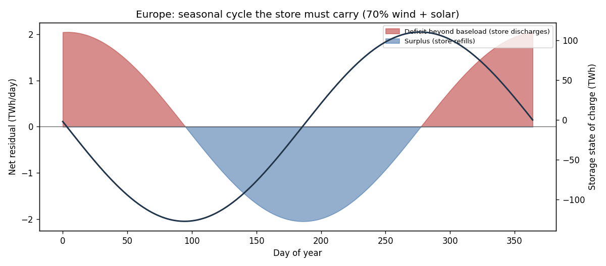

## Layer 2 — Who causes it?

| Sector | EU-27 | Germany | Moves with the weather? |
|---|---|---|---|
| Households | 27% | 30% | yes — space heating |
| Commercial & public services | 12% | 13% | yes — space heating |
| Power & heat generation | 33% | 30% | partly — district heat and cold-snap dispatch |
| Industry | 28% | 27% | barely — process heat runs year-round |

So **47% of EU gas and 49% of German gas sits in weather-driven end uses.** The winter peak is a buildings phenomenon before it is anything else; industry is close to a flat baseload and does not create the swing it is often blamed for.

Within German industry the load is concentrated: **Chemical and petrochemical 54 TWh**, **Food, beverages and tobacco 32 TWh**, **Non-metallic minerals 22 TWh**, **Paper, pulp and printing 19 TWh**, **Iron and steel 19 TWh**.

For scale on the electricity side, **German data centres used ≈20 TWh of electricity in 2024**, heading for 25–37 TWh by 2030. That is a large and growing *flat* load on the power system; it does not touch the seasonal gas swing, but it does compete for the same firm winter generation capacity.

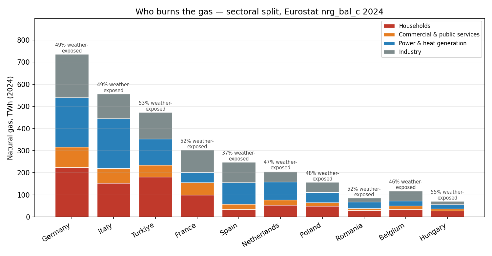
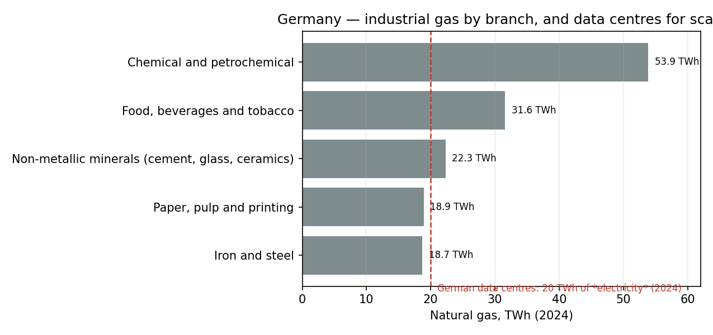

## Layer 3 — What carries the system through it?

Storage, almost entirely. In 2025 the EU injected **557 TWh** between April and October and withdrew **667 TWh** back out over the winter, peaking at **201 TWh in a single month** — an average delivery rate of **270 GW held for thirty days**.

Across the 14 countries with a storage fleet of consequence the **median country's withdrawal equals 104% of its own measured seasonal swing** — storage is not a supplement to winter, it *is* winter. The outliers are informative rather than noisy: transit states such as Latvia and Slovakia draw far more than their domestic swing because they store for neighbours, while Spain and Portugal draw less because LNG regasification does part of the job instead.

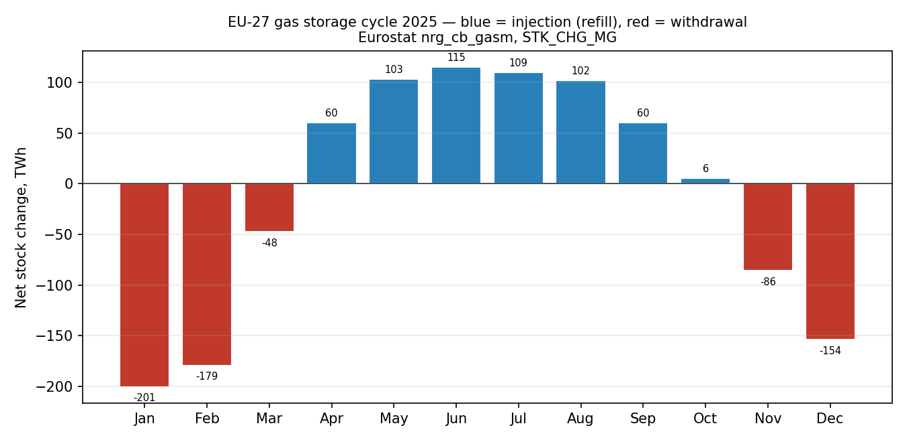

## Layer 4 — How much margin is left in the fleet?

GIE AGSI+, gas day **2026-07-18**: the EU holds **1130 TWh** of working volume, can withdraw **20.0 TWh/d** and inject only **12.3 TWh/d**. At maximum rate a full fleet lasts **56 days**; refilling it takes **92 days**. That asymmetry is the whole reason the refill season starts in April — there is no way to do it quickly.

| Country | Working volume (TWh) | Withdrawal (TWh/d) | Days at max rate | Fill today |
|---|---|---|---|---|
| Germany | 246.5 | 7.07 | 35 | 45% |
| Italy | 203.4 | 2.85 | 71 | 72% |
| Netherlands | 143.8 | 2.65 | 54 | 32% |
| France | 123.9 | 2.42 | 51 | 53% |
| Austria | 100.3 | 1.08 | 93 | 58% |
| Hungary | 67.7 | 0.82 | 83 | 56% |
| Czechia | 45.3 | 0.73 | 62 | 56% |
| Poland | 36.9 | 0.60 | 62 | 79% |
| Slovakia | 36.7 | 0.69 | 53 | 41% |
| Spain | 35.8 | 0.21 | 171 | 72% |
| Romania | 33.9 | 0.31 | 108 | 55% |
| Latvia | 24.4 | 0.07 | 330 | 43% |

**Two different assets are hiding in this table.** Germany holds the most gas (246 TWh) but empties in **35 days** at full rate — a salt-cavern-heavy, fast-cycling fleet built for peaks. Spain's store lasts **171 days** and Austria's **93**: slow, deep, seasonal assets. Comparing countries on TWh alone hides this completely.

### Which winters were tight, and where

| Gas year | Peak fill | Trough fill | Max EU withdrawal | On |
|---|---|---|---|---|
| 2019/20 | 95% (2020-09-27) | 54% (2020-03-31) | 8.87 TWh/d | 2020-01-21 |
| 2020/21 | 96% (2020-10-11) | 29% (2021-04-19) | 10.87 TWh/d | 2021-01-15 |
| 2021/22 | 89% (2022-09-30) | 26% (2022-03-19) | 8.78 TWh/d | 2021-12-22 |
| 2022/23 | 96% (2022-11-13) | 55% (2023-04-07) | 8.58 TWh/d | 2022-12-13 |
| 2023/24 | 100% (2023-11-05) | 58% (2024-03-31) | 9.89 TWh/d | 2024-01-10 |
| 2024/25 | 95% (2024-10-21) | 34% (2025-03-27) | 10.60 TWh/d | 2025-01-21 |
| 2025/26 | 83% (2025-10-12) | 28% (2026-03-31) | 10.45 TWh/d | 2026-01-07 |

**2025/26 is the weakest entry into winter on record here.** Storage topped out at only **83%** on 2025-10-12 — every other gas year since 2019 reached 88–99% — and bottomed at **28%**. Peak EU withdrawal still hit **10.45 TWh/d** on 2026-01-07, about **52%** of the fleet's maximum rate. The fleet had the *speed*; what it was short of was *stock*.

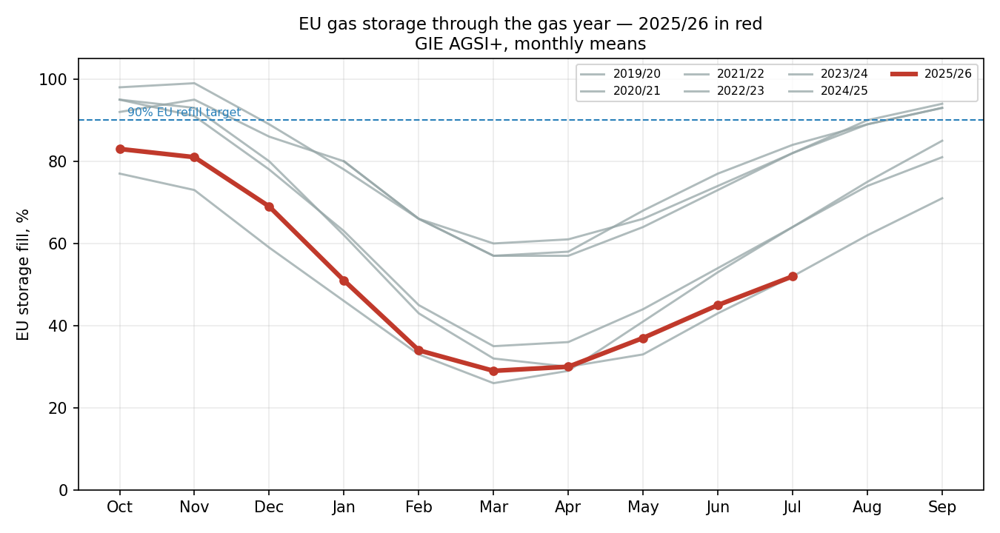

### Who ran out of delivery rate rather than gas

On its own peak day last winter each country used this share of its own maximum withdrawal rate. Above ≈85%% there is no headroom left for a colder day:

| Country | Peak withdrawal | Capacity | Utilisation | Lowest fill |
|---|---|---|---|---|
| Belgium | 0.17 TWh/d | 0.18 TWh/d | 96% | 22% |
| Portugal | 0.09 TWh/d | 0.09 TWh/d | 96% | 77% |
| Croatia | 0.05 TWh/d | 0.05 TWh/d | 90% | 10% |
| Bulgaria | 0.04 TWh/d | 0.05 TWh/d | 89% | 34% |
| Spain | 0.18 TWh/d | 0.21 TWh/d | 87% | 56% |
| Romania | 0.28 TWh/d | 0.34 TWh/d | 84% | 24% |
| Austria | 0.85 TWh/d | 1.12 TWh/d | 76% | 32% |
| France | 1.90 TWh/d | 2.50 TWh/d | 76% | 21% |
| Latvia | 0.19 TWh/d | 0.28 TWh/d | 68% | 20% |
| Hungary | 0.52 TWh/d | 0.80 TWh/d | 65% | 32% |
| Czechia | 0.45 TWh/d | 0.74 TWh/d | 62% | 28% |
| Poland | 0.36 TWh/d | 0.60 TWh/d | 61% | 45% |
| Denmark | 0.11 TWh/d | 0.19 TWh/d | 57% | 26% |
| Slovakia | 0.34 TWh/d | 0.69 TWh/d | 50% | 22% |
| Germany | 3.43 TWh/d | 7.31 TWh/d | 47% | 20% |
| Netherlands | 1.28 TWh/d | 2.76 TWh/d | 46% | 5% |
| Italy | 1.34 TWh/d | 3.00 TWh/d | 44% | 43% |

**Belgium, Portugal, Croatia, Bulgaria, Spain ran their storage flat out.** These are small fleets with no second gear: a colder January does not get met from underground, it gets met from an interconnector or not at all. By contrast Germany used only **47%** of its withdrawal rate, Italy **44%** and the Netherlands **46%** — the large fleets are volume-constrained, the small ones are rate-constrained, and a single European target expressed in % full addresses neither.

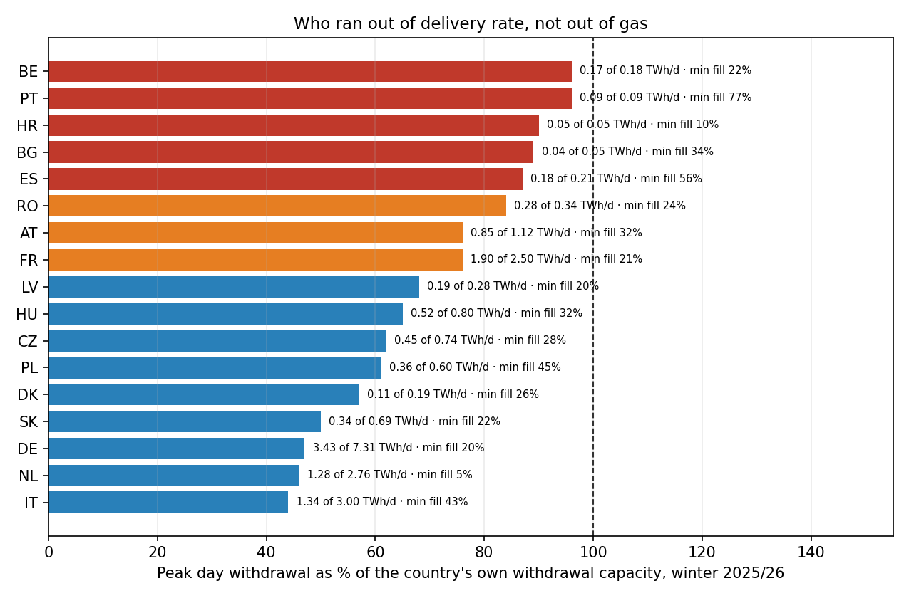

### Germany, site by site

Germany's 246 TWh is not one asset — it is 46 sites run by 23 companies, and the top five hold **102 TWh, 41% of the national total**:

| Site | Operator | Working volume | Withdrawal | Fill on 2026-07-18 |
|---|---|---|---|---|
| UGS Rehden | SEFE Storage (Germany) | 35.7 TWh | 434 GWh/d | 6% |
| VGS Storage Hub (Bernburg, Bad Lauchstaedt, Katharina) | VNG Gasspeicher | 28.8 TWh | 785 GWh/d | 46% |
| UGS Epe Uniper H-Gas | Uniper Energy Storage | 15.4 TWh | 469 GWh/d | 74% |
| UGS Breitbrunn | Uniper Energy Storage | 11.4 TWh | 144 GWh/d | 10% |
| UGS Etzel ESE | Uniper Energy Storage | 10.8 TWh | 404 GWh/d | 53% |
| UGS Etzel Erdgas Lager EGL | Uniper Energy Storage | 10.5 TWh | 276 GWh/d | 79% |
| UGS Uelsen | Storengy Deutschland | 9.9 TWh | 109 GWh/d | 48% |
| UGS Etzel EKB | EKB | 9.5 TWh | 217 GWh/d | 71% |
| UGS Jemgum H | SEFE Storage (Germany) | 9.4 TWh | 253 GWh/d | 64% |
| UGS Bierwang | Uniper Energy Storage | 9.4 TWh | 357 GWh/d | 61% |

**Rehden alone is 36 TWh — 14% of German working volume — and it stands at 6% full.** It is a depleted field, not a cavern: slow to fill, slow to draw, and it has been the single biggest swing factor in German storage statistics since 2022. Any headline about German storage percentages is largely a statement about one site in Lower Saxony.

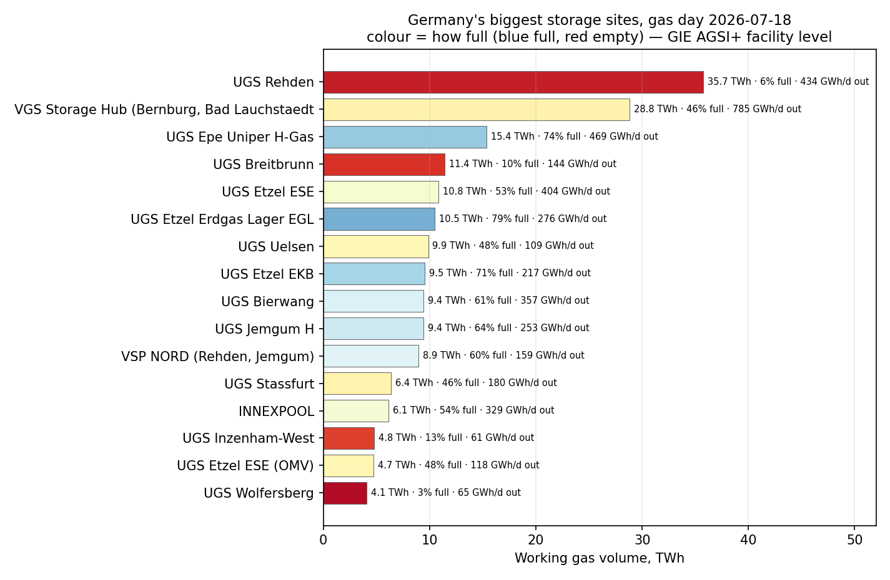

### Caverns or ships — the other half of the flexibility

Storage is not the only way to meet a cold day. LNG regasification supplies the same service at a rate, and the two are only comparable on the **peak day** — comparing winter totals would be meaningless, because send-out carries baseload as well as swing.

| Country | Storage withdrawal | LNG send-out | Share from ships |
|---|---|---|---|
| Spain | 0.18 TWh/d | 0.97 TWh/d | **84%** |
| Belgium | 0.17 TWh/d | 0.72 TWh/d | **81%** |
| Portugal | 0.09 TWh/d | 0.19 TWh/d | **68%** |
| Croatia | 0.05 TWh/d | 0.10 TWh/d | **67%** |
| Poland | 0.36 TWh/d | 0.28 TWh/d | **44%** |
| Netherlands | 1.28 TWh/d | 0.80 TWh/d | **38%** |
| France | 1.90 TWh/d | 1.17 TWh/d | **38%** |
| Italy | 1.34 TWh/d | 0.81 TWh/d | **38%** |
| Germany | 3.43 TWh/d | 0.54 TWh/d | **14%** |

This resolves the puzzle from Layer 3, where Belgium's storage covered only 24% of its swing. It is not exposed — it is differently exposed: **84% of Spain's and 81% of Belgium's peak day arrived by ship**, against **14% for Germany**. Regasification is faster to build and needs no geology, but it is supplied by the global LNG market on exactly the days when every other importer is bidding for the same cargo. Caverns are pre-positioned; ships are not. A European adequacy assessment that counts only % of storage full will score Iberia as safe and miss the actual dependency entirely.

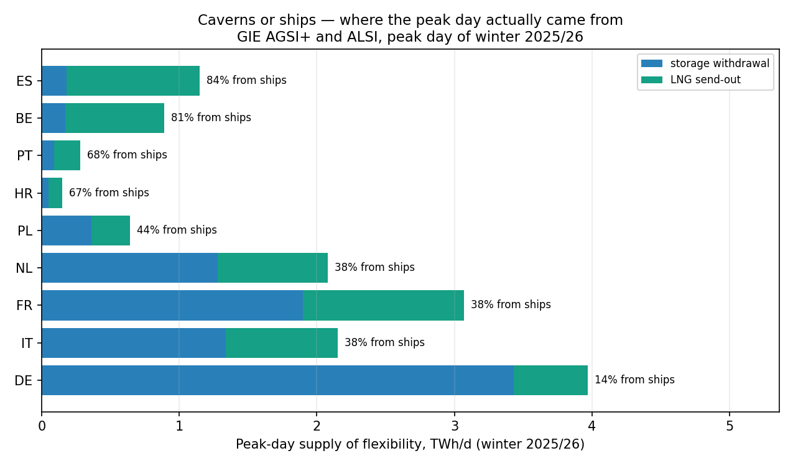

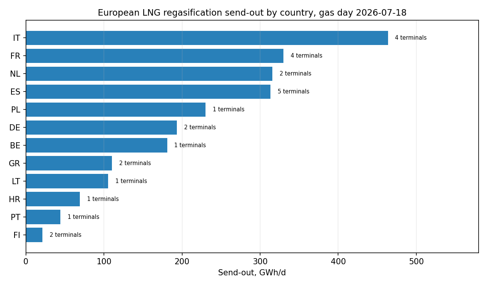

## Layer 5 — Where the pipes bind

ENTSOG, peak winter gas day **2026-01-15**. Germany imported **1015 GWh/d** from Norway through two coastal clusters — Emden and Dornum — and both ran *above* their published firm technical capacity (**162%** and **139%**). The excess is interruptible or additional capacity: legally curtailable. Meanwhile **VIP Waidhaus, the old Russian route into Bavaria, sat at zero**, and **Mallnow ran backwards** — exporting to Poland at 86% of firm.

| Border point | Corridor | Flow | Firm capacity | Utilisation |
|---|---|---|---|---|
| Dornum / NETRA | NO->DE | 589 GWh/d | 423 GWh/d | 139% |
| Emden (EPT1) | NO->DE | 426 GWh/d | 263 GWh/d | 162% |
| Mallnow | DE->PL | 223 GWh/d | 259 GWh/d | 86% |
| VIP Brandov | DE->CZ | 220 GWh/d | 347 GWh/d | 63% |
| VIP Oberkappel | DE->AT | 217 GWh/d | 215 GWh/d | 101% |
| VIP Germany-CH | DE->CH | 195 GWh/d | 404 GWh/d | 48% |
| Uberackern ABG | DE->AT | 68 GWh/d | 0 GWh/d | not published |
| GCP GAZ-SYSTEM/ONTRAS | DE->PL | 49 GWh/d | 49 GWh/d | 100% |
| VIP Waidhaus | DE->CZ | 0 GWh/d | 0 GWh/d | not published |
| Uberackern SUDAL | DE->AT | 0 GWh/d | 0 GWh/d | not published |

The bottleneck is not pipe diameter. It is **concentration**: a single sea-facing corridor now carries the load that used to arrive from three directions, and it is doing so on non-firm terms.

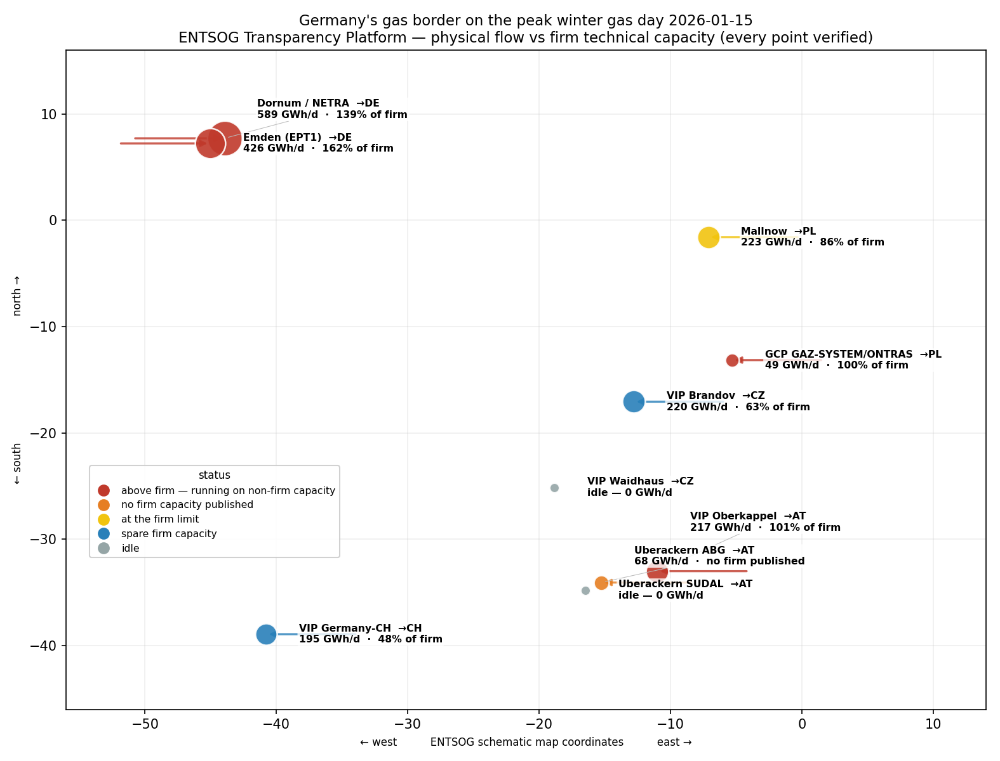

## The applied question — how long does a cold spell take to break something?

Everything above is measurement. This is the test an operator, a regulator or a trader actually runs: **if it turns cold and stays cold, how many days do we have, and what fails first?** Storage stock starts at each country's own peak fill last winter; the daily call is its own observed worst day, scaled; LNG send-out supplies what it can and storage covers the rest, capped by published withdrawal capacity.

Two failure modes, with opposite remedies:

- **Rate-bound (day 1)** — capacity in GW cannot meet the call at all. More gas underground would change nothing; the fix is compressors, wells and interconnection.
- **Volume-bound (day n)** — the rates are fine, the inventory empties. The fix is more cavern, or more imports booked earlier.

| Country | Starting fill | Daily call | 1.0x worst day | 1.2x | 1.4x |
|---|---|---|---|---|---|
| Belgium | 94% | 0.89 TWh/d | day 1 — **rate** | day 1 — **rate** | day 1 — **rate** |
| Latvia | 61% | 0.19 TWh/d | day 1 — **rate** | day 1 — **rate** | day 1 — **rate** |
| Portugal | 97% | 0.28 TWh/d | day 1 — **rate** | day 1 — **rate** | day 1 — **rate** |
| Denmark | 65% | 0.11 TWh/d | day 51 | day 43 | day 37 |
| Germany | 76% | 3.97 TWh/d | day 55 | day 45 | day 38 |
| France | 94% | 3.07 TWh/d | day 62 | day 1 — **rate** | day 1 — **rate** |
| Croatia | 76% | 0.15 TWh/d | day 73 | day 1 — **rate** | day 1 — **rate** |
| Netherlands | 73% | 2.08 TWh/d | day 83 | day 62 | day 50 |
| Slovakia | 76% | 0.34 TWh/d | day 83 | day 69 | day 59 |
| Czechia | 93% | 0.45 TWh/d | day 94 | day 79 | day 67 |
| Hungary | 73% | 0.52 TWh/d | day 96 | day 80 | day 68 |
| Austria | 86% | 0.85 TWh/d | day 102 | day 85 | day 1 — **rate** |
| Poland | 101% | 0.64 TWh/d | day 104 | day 77 | day 1 — **rate** |
| Romania | 99% | 0.28 TWh/d | day 120 | day 1 — **rate** | day 1 — **rate** |
| Italy | 95% | 2.15 TWh/d | day 145 | day 110 | day 88 |
| Bulgaria | 84% | 0.04 TWh/d | day 148 | day 1 — **rate** | day 1 — **rate** |
| Spain | 87% | 1.15 TWh/d | day 174 | day 1 — **rate** | day 1 — **rate** |

**At a repeat of last winter's worst day, Belgium, Latvia, Portugal are already rate-bound on day one** — they were at their delivery ceiling, not their inventory ceiling. Push severity to 1.4x and the rate-bound set grows to Austria, Belgium, Bulgaria, Spain, France, Croatia, Latvia, Poland, Portugal, Romania: **a colder winter does not slowly drain Europe, it converts volume problems into rate problems.** That is a different failure, on a different timescale, with a different fix — and it is completely invisible in a storage-fill percentage.

Germany, the largest fleet in Europe, empties in **55 days** at 1.0x and **45 days** at 1.2x. Spain, with a seventh of the volume, holds **174 days** — because most of its peak arrives by ship rather than out of the ground.

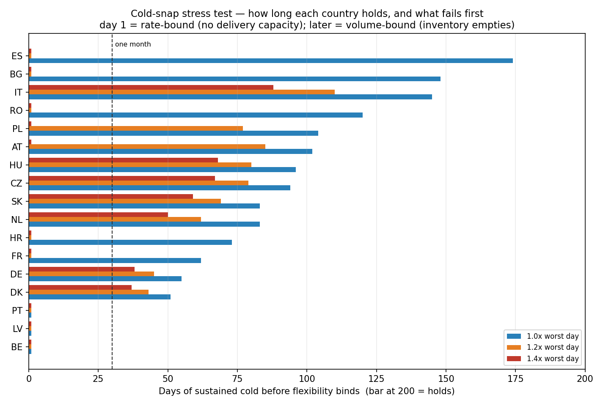

## What happens when the same fleet has to hold hydrogen

Hydrogen holds about **0.30** of methane's energy per cubic metre, and a cavern stores a volume, not an energy. Repurposed, Europe's **1100 TWh** of gas storage becomes **260 TWh** of hydrogen storage — an energy shrink of **4.2x**.

| Store type | Hydrogen-capable energy (TWh) |
|---|---|
| Depleted gas fields | 171 |
| Salt caverns | 49 |
| Aquifers | 40 |

Salt caverns — the only store type with an established hydrogen track record — carry **49 TWh** of that. Set against the measured seasonal swing from Layer 1, the comfortable methane buffer becomes a thin margin, and it thins further as electrification pushes more of the heating load onto the power system.

**So what — the choice this forces, not a dead end.** "We already have the storage" does not survive the volumetric arithmetic; the same holes hold roughly a fifth of the energy on hydrogen. That does not make the transition impossible, it makes it a sizing decision with three levers, none free:

1. **Keep methane storage for the seasonal job and decarbonise the molecule elsewhere** (biomethane, synthetic methane, or carbon capture on the burn) — the existing 1100 TWh buffer stays intact, but the abatement moves upstream and has to be paid for there.

2. **Repurpose to hydrogen and rebuild the missing volume** — to hold the same *energy* on hydrogen Europe would need on the order of **four to five times the cavern volume it has today**, and suitable salt geology is concentrated in a handful of regions (northern Germany, the Netherlands, parts of the UK and Iberia), not evenly available where the demand sits. New-build is therefore both a capital and a siting problem, not just an engineering one.

3. **Qualify the depleted fields and aquifers** that hold 211 of the 260 TWh — the only way the numbers close without massive new salt caverns — which is exactly where the hydrogen track record is thinnest (cushion-gas losses, gas purity, microbial activity, deliverability).

The engineering-and-strategy point is that this is a decision to be sized now, on this arithmetic, rather than an assumption to be waved through. A policy that treats the existing fleet as a free hydrogen buffer will under-build seasonal storage by roughly the factor above and discover the gap in a cold winter, when it cannot be closed quickly.

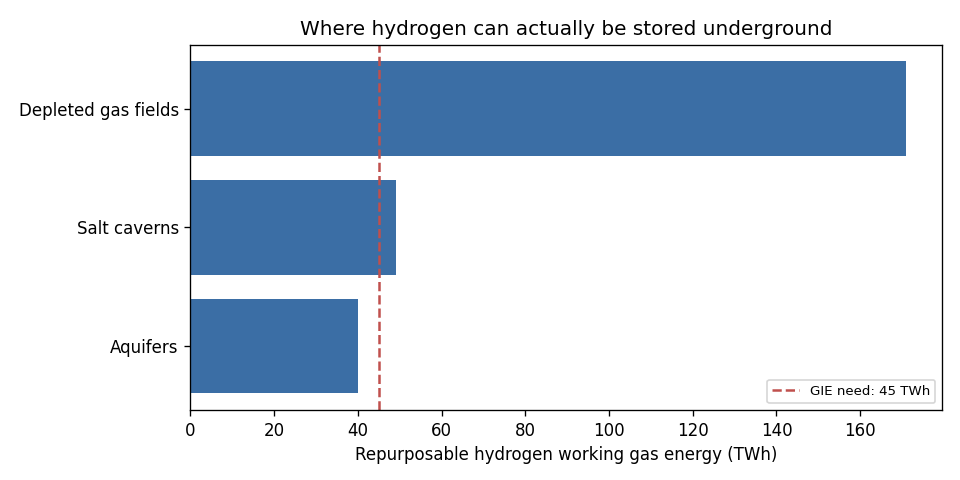

## What this all adds up to

1. **Demand did not de-seasonalise.** Less gas, same winter shape (3.18x median peak/trough in 2025, up from 2.73x in 2020). Efficiency cut the level, not the swing.

2. **The swing is a buildings problem.** ≈47% of EU gas is weather-driven; industry is essentially flat. Policy aimed at industrial gas does not touch the peak.

3. **Storage is the whole answer today**, covering ≈100% of every storage-owning country's swing, at a European peak of ≈270 GW sustained for a month. No battery fleet is within four orders of magnitude of that job.

4. **Two different scarcities exist and get conflated.** Large fleets (DE, IT, NL) are short of *volume*; small ones (BE, PT, HR, BG, ES) are short of *rate*. A single "% full" target is the wrong instrument for both.

5. **2025/26 entered winter at 83% — the weakest on this record** — and the risk showed up as stock, not as speed.

6. **Half of southern Europe's peak day arrives by ship.** 84% for Spain, 81% for Belgium, against 14% for Germany — a dependency invisible to any storage-fill target.

7. **Germany has become a re-export hub, and its import points run above firm.** Norway lands 1,015 GWh/d at two coastal clusters (both above firm), and Germany forwards it on — Brandov to Czechia, Oberkappel to Austria, Germany-CH to Switzerland, Mallnow reversed to Poland. The Russian-era route at Waidhaus sits at zero; the load moved to the North Sea coast.

8. **Hydrogen does not inherit this buffer.** The same holes hold 4.2x less energy, so the seasonal margin has to be rebuilt, not converted.

---

*Reproduce: `python src/research.py`. Live refresh needs `AGSI_KEY` (free, https://agsi.gie.eu/account); Eurostat and ENTSOG need no key.*

