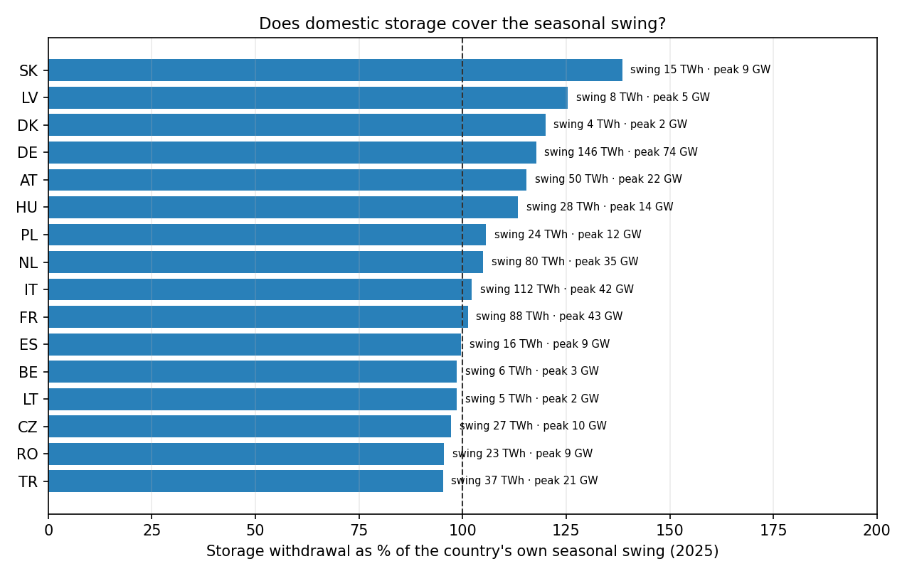
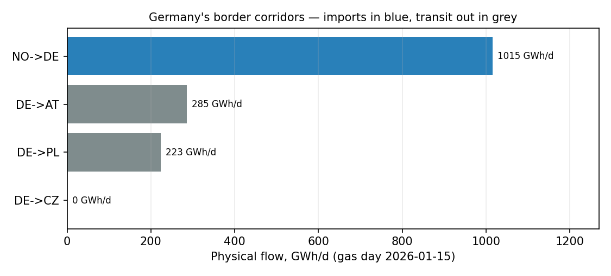

# Results — seasonal swing of gas demand in Europe, 2020–2026

Source: **Eurostat `nrg_cb_gasm`** (inland gas consumption, monthly, TJ GCV), pulled 2026-07-20, raw responses in `data/raw/`. **38 countries, 217 complete country-years, 0 validation issues.** Every number below is computed, not assumed.

## 1. How uneven is demand, and is it getting worse?

Median across all countries, per year:

| Year | Countries | Median peak/trough | Median winter/summer | Median swing above baseline |
|---|---|---|---|---|
| 2020 | 33 | 2.73 | 2.12 | 14.8% |
| 2021 | 34 | 2.98 | 2.30 | 15.2% |
| 2022 | 32 | 3.06 | 2.15 | 14.9% |
| 2023 | 32 | 2.74 | 1.97 | 13.1% |
| 2024 | 33 | 2.92 | 2.07 | 14.9% |
| 2025 | 33 | 3.18 | 2.44 | 16.8% |

EU-27 as one system:

| Year | Annual gas (TWh) | Peak/trough | Winter/summer | Swing above baseline (TWh) |
|---|---|---|---|---|
| 2020 | 4213 | 2.29 | 2.05 | 598 |
| 2021 | 4396 | 2.72 | 2.34 | 671 |
| 2022 | 3803 | 2.75 | 2.24 | 579 |
| 2023 | 3534 | 2.32 | 2.16 | 516 |
| 2024 | 3547 | 2.59 | 2.27 | 557 |
| 2025 | 3637 | 2.68 | 2.45 | 599 |

**Read:** consumption fell hard after 2021, but the *shape* did not flatten — the median peak-to-trough ratio is higher in 2025 than in 2020. Less gas, same winter dependence.

## 2. Which countries lean hardest on winter supply?

Mean over 2020–2025:

| Rank | Country | Peak/trough | Winter/summer | Swing above baseline | Annual gas (TWh, 2025) |
|---|---|---|---|---|---|
| 1 | North Macedonia (MK) | 10.47 | 1.78 | 19.9% | 3 |
| 2 | Moldova (MD) | 7.50 | 5.99 | 31.3% | 9 |
| 3 | Latvia (LV) | 7.33 | 4.01 | 24.5% | 9 |
| 4 | Albania (AL) | 5.60 | 1.08 | 15.4% | 0 |
| 5 | Georgia (GE) | 4.72 | 3.83 | 24.2% | 35 |
| 6 | Estonia (EE) | 4.70 | 3.65 | 21.7% | 3 |
| 7 | France (FR) | 4.14 | 3.35 | 21.7% | 344 |
| 8 | Hungary (HU) | 3.98 | 3.42 | 21.5% | 96 |
| 9 | Ukraine (UA) | 3.68 | 3.17 | 22.3% | n/a |
| 10 | Slovakia (SK) | 3.63 | 3.05 | 19.8% | 50 |
| 11 | Luxembourg (LU) | 3.63 | 2.80 | 17.5% | 7 |
| 12 | Romania (RO) | 3.58 | 3.08 | 21.0% | 107 |
| 13 | Czechia (CZ) | 3.48 | 3.10 | 20.1% | 79 |
| 14 | Germany (DE) | 3.47 | 3.00 | 19.4% | 865 |
| 15 | Austria (AT) | 3.40 | 2.96 | 19.0% | 83 |
| 16 | Serbia (RS) | 3.29 | 2.89 | 19.6% | 31 |
| 17 | Turkiye (TR) | 2.92 | 2.13 | 15.7% | 621 |
| 18 | Lithuania (LT) | 2.82 | 1.93 | 12.5% | 19 |
| 19 | Finland (FI) | 2.75 | 1.64 | 12.1% | 15 |
| 20 | Croatia (HR) | 2.74 | 1.97 | 13.2% | 30 |
| 21 | Sweden (SE) | 2.74 | 1.72 | 11.8% | 9 |
| 22 | Denmark (DK) | 2.58 | 2.18 | 14.0% | 26 |
| 23 | Belgium (BE) | 2.53 | 2.20 | 14.6% | 156 |
| 24 | Netherlands (NL) | 2.45 | 2.05 | 13.5% | 293 |
| 25 | Italy (IT) | 2.45 | 2.02 | 14.1% | 668 |
| 26 | Slovenia (SI) | 2.40 | 2.07 | 13.5% | 10 |
| 27 | Poland (PL) | 2.26 | 2.01 | 13.0% | 234 |
| 28 | Bulgaria (BG) | 2.20 | 1.81 | 11.7% | 30 |
| 29 | Greece (EL) | 1.86 | 1.08 | 7.1% | 71 |
| 30 | Malta (MT) | 1.77 | 0.78 | 6.6% | 4 |
| 31 | Spain (ES) | 1.55 | 1.27 | 5.7% | 331 |
| 32 | Portugal (PT) | 1.47 | 1.04 | 4.7% | 45 |
| 33 | Ireland (IE) | 1.45 | 1.23 | 4.7% | 54 |
| 34 | Norway (NO) | 1.30 | 1.03 | 2.9% | 52 |

## 3. Germany in detail

| Year | Annual gas (TWh) | Peak month | Trough month | Peak/trough | Swing above baseline (TWh) |
|---|---|---|---|---|---|
| 2020 | 962 | Jan | Aug | 2.73 | 166 |
| 2021 | 1009 | Jan | Aug | 3.68 | 194 |
| 2022 | 854 | Jan | Aug | 4.05 | 171 |
| 2023 | 821 | Jan | Jul | 3.42 | 162 |
| 2024 | 837 | Jan | Aug | 3.38 | 161 |
| 2025 | 865 | Jan | Jun | 3.58 | 181 |

**Read:** Germany's annual gas use fell ≈14% from 2021 to 2025, yet the winter peak still runs 3.6x the summer trough, and ≈181 TWh a year has to be carried from summer into winter.

## 4. Who burns it, and which part of it moves with the weather

Source: **Eurostat `nrg_bal_c`**, natural gas, GWh, 2024 (`data/raw/gas_sectors_2024.json`).

| Country | Power & heat | Industry | Households | Commercial & public | Total (TWh) | Weather-exposed |
|---|---|---|---|---|---|---|
| EU-27 | 33% | 28% | 27% | 12% | 2887 | 47% |
| Germany | 30% | 27% | 30% | 13% | 736 | 49% |
| Italy | 40% | 20% | 28% | 12% | 556 | 49% |
| Turkiye | 25% | 25% | 38% | 11% | 474 | 53% |
| France | 15% | 33% | 33% | 19% | 302 | 52% |
| Spain | 39% | 37% | 14% | 10% | 248 | 37% |
| Netherlands | 40% | 23% | 26% | 11% | 207 | 47% |
| Poland | 30% | 29% | 31% | 10% | 157 | 48% |
| Romania | 33% | 21% | 36% | 10% | 86 | 52% |
| Belgium | 19% | 38% | 29% | 14% | 118 | 46% |
| Hungary | 29% | 20% | 40% | 11% | 71 | 55% |
| Czechia | 24% | 32% | 27% | 17% | 63 | 48% |
| Austria | 30% | 43% | 20% | 7% | 62 | 38% |

**Where the swing comes from.** Industry runs process heat more or less flat through the year; households and commercial buildings are almost pure space heating. So the winter peak is overwhelmingly a *buildings* phenomenon, amplified by gas-fired power and district heat in cold snaps. In Germany ≈49% of gas volume sits in weather-driven end uses — which is why a mild winter moves the whole European balance.

### Germany — which factories

| Branch | Gas, TWh (2024) |
|---|---|
| Chemical and petrochemical | 53.9 |
| Food, beverages and tobacco | 31.6 |
| Non-metallic minerals (cement, glass, ceramics) | 22.3 |
| Paper, pulp and printing | 18.9 |
| Iron and steel | 18.7 |

Chemicals alone burn 54 TWh — more than the next two branches combined, and this is *energy use only*, excluding gas used as feedstock. For scale, **German data centres consumed ≈20 TWh of electricity in 2024**, projected to 25–37 TWh by 2030 (Borderstep/Bitkom). Data centres are a fast-growing *electricity* load, not a gas load — they add to the power system's flat baseload, not to the seasonal gas swing.

## 5. What refills it, and where the bottlenecks are

Source: **Eurostat `nrg_cb_gasm`, STK_CHG_MG** (stock changes), 2025 monthly (`data/raw/gas_stock_change_2025.json`). Positive = injection, negative = withdrawal.

In 2025 the EU-27 injected **557 TWh** into storage between April and October and withdrew **667 TWh** over the winter. The single heaviest month took **201 TWh** out — an average delivery rate of about **270 GW**, sustained for a month. That is the physical answer to "what replenishes it": summer pipeline and LNG imports, parked underground, released again from November.

| Country | Seasonal swing (TWh) | Storage withdrawal (TWh) | Cover | Peak withdrawal rate (GW) |
|---|---|---|---|---|
| Germany | 180.9 | 172.0 | 95% | 73.7 |
| Turkiye | 104.5 | 35.6 | 34% | 20.9 |
| Italy | 102.4 | 114.9 | 112% | 41.8 |
| France | 81.1 | 89.5 | 110% | 43.0 |
| Netherlands | 44.7 | 83.9 | 187% | 34.7 |
| Poland | 31.5 | 24.9 | 79% | 11.5 |
| Belgium | 25.3 | 6.2 | 24% | 3.0 |
| Romania | 22.8 | 22.3 | 98% | 9.1 |
| Hungary | 22.3 | 31.4 | 141% | 13.9 |
| Spain | 19.2 | 16.3 | 85% | 8.7 |
| Austria | 17.2 | 57.4 | 334% | 21.6 |
| Czechia | 16.5 | 26.3 | 159% | 9.9 |
| Slovakia | 10.1 | 20.9 | 206% | 8.6 |
| Georgia | 8.2 | 0.0 | n/a | 0.0 |
| Greece | 6.3 | 2.8 | 45% | 1.0 |
| Serbia | 6.2 | 2.1 | 34% | 1.2 |

**Conclusion.** The median country with a real fleet withdraws **96% of its own seasonal swing** from storage — storage is not a supplement to winter, it *is* winter. The spread around that median is the interesting part:

- **Austria 334%, Czechia 159%, Netherlands 187%** — these fleets are far larger than domestic need because they store for neighbours and for the traded market.
- **Belgium 24%, Turkiye 34%** — a low ratio does not mean comfort. It means the swing is met by LNG regasification and pipeline flexibility arriving in real time instead, which is faster to interrupt than a cavern.

The bottleneck is therefore not the annual volume but two other things:

1. **Deliverability.** Germany alone must pull ≈74 GW out of the ground in the peak month. A field that holds the energy but cannot deliver the rate is useless in a cold snap.

2. **Countries with no storage at all.** Ireland (54 TWh/y), Georgia (35 TWh/y), Slovenia (10 TWh/y), Moldova (9 TWh/y), Luxembourg (7 TWh/y), Estonia (3 TWh/y), North Macedonia (3 TWh/y) consume gas but hold none of it underground. Their entire winter swing has to arrive in real time through a pipeline or an LNG terminal — so an interconnector outage there is immediately a supply event, not a price event.

## 6. The network — where the gas physically has to squeeze through

Source: **ENTSOG Transparency Platform** (`transparency.entsog.eu/api/v1`, open, no API key), gas day **2026-01-15**, cached in `data/raw/entsog_de_border_2026-01-15.json`. Utilisation = physical flow / firm technical capacity at the same point-direction.

| Border point | Operator | Corridor | Flow (GWh/d) | Firm capacity (GWh/d) | Utilisation | Status |
|---|---|---|---|---|---|---|
| Dornum / NETRA | OGE | NO->DE | 589 | 423 | 139% | above firm — running on non-firm capacity |
| Emden (EPT1) | OGE | NO->DE | 426 | 263 | 162% | above firm — running on non-firm capacity |
| Mallnow | GASCADE | DE->PL | 223 | 259 | 86% | at the firm limit |
| VIP Brandov | GASCADE | DE->CZ | 220 | 347 | 63% | spare firm capacity |
| VIP Oberkappel | OGE | DE->AT | 217 | 215 | 101% | above firm — running on non-firm capacity |
| VIP Germany-CH | Fluxys TENP | DE->CH | 195 | 404 | 48% | spare firm capacity |
| Uberackern ABG | OGE | DE->AT | 68 | 0 | — | no firm capacity published |
| GCP GAZ-SYSTEM/ONTRAS | ONTRAS | DE->PL | 49 | 49 | 100% | above firm — running on non-firm capacity |
| VIP Waidhaus | OGE | DE->CZ | 0 | 0 | — | idle |
| Uberackern SUDAL | bayernets | DE->AT | 0 | 228 | 0% | idle |

**Conclusion.** On a peak winter day Germany pulls **1015 GWh/d** in from Norway through just two point clusters, Emden and Dornum, and both are running *above* their published firm capacity — 162% and 139% respectively. That extra volume is interruptible or additional capacity: contractually curtailable, not guaranteed. The single-corridor concentration is the bottleneck, not the pipe diameter.

The same day the map of 2019 is visibly redrawn on the export side: **to AT 285 GWh/d**, **to PL 272 GWh/d**, **to CZ 220 GWh/d**, **to CH 195 GWh/d**. **Mallnow now runs west-to-east** (exporting to Poland at 86% of firm, no longer importing), and **VIP Waidhaus — the old Russian route into Bavaria — sits at exactly zero**. But the eastern border is not dead: **VIP Brandov still carries 220 GWh/d into Czechia** and the Polish ONTRAS point runs at its firm limit. Germany has turned from a Russian-gas destination into a **hub that re-exports Norwegian and LNG-sourced gas** south and east — which is exactly why its own import points run above firm.

> **Reading note — Uberackern.** The Uberackern crossing to Austria appears as two ENTSOG points run by two operators: **SUDAL** (bayernets) publishes 228 GWh/d of firm capacity but was not nominated that day (idle), while **ABG** (OGE) metered 68 GWh/d of real flow but publishes no current capacity at all — its capacity fields are stale (last updated 2015). So ABG's "0 firm" is a *publication gap*, not a physical zero: capacity and flow for this border are split across the two point IDs. This is exactly the multi-operator fragmentation that Virtual Interconnection Points (VIPs) exist to consolidate.

## 7. What this means for storage

- The swing above a flat baseline is what storage and flexible supply must cover. For the EU it is on the order of **hundreds of TWh every year** — that is the job underground storage does today.
- Batteries do not touch this: the entire EU grid-battery fleet is ≈0.04 TWh, four orders of magnitude below the seasonal task.
- Repurposing the gas storage fleet to hydrogen cuts its stored energy ≈4.2x (1,100 TWh → 260 TWh), because a cavern holds a **volume**, not an energy.

## 8. What is NOT in this repo yet (honest gaps)

- **Hourly deliverability** — AGSI+ publishes daily rates, not the hourly ramp a cold snap actually demands; intraday flexibility is out of scope here.
- **The rest of Europe's border points** — the ENTSOG client in `src/entsog.py` fetches any country pair live; the bundled snapshot covers Germany's borders with NO, PL, CZ, AT and CH. Run it with a network connection to extend to NL, BE, FR, DK and the rest of the EU.
- **Electricity grid congestion** — ENTSO-E's Transparency Platform needs a free registered token: register on the site, then email transparency@entsoe.eu for RESTful API access.
- **Named sites** — no open pan-European dataset ties an individual plant or data centre to metered demand, so branch-level is as granular as public data honestly goes.

